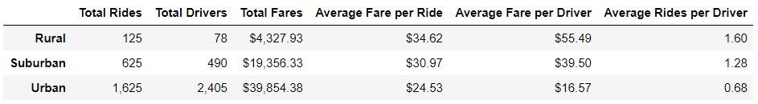

# PyBer Analysis

## Overview
The purpose of this analysis is to visualize how the data differs by city type and how those differences can be used by decision-makers at PyBer.
For that, a summary DataFrame and a line plot were created.

## Results
- As can be seen from the following table, the *Total Rides*, *Total Drivers* and *Total Fares* columns all seem to be directly correlated with *Rural* being the smallest, the *Suburban* and *Urban* the largest. 
- This is explained by the fact that *Total Rides* corresponds to the demand of rides. if there is a bigger demand, there are more job opportunities (more supply, more drivers), and if the demand is bigger than the supply, prices go up, more revenue.
- When analysing the *Average Fare per Ride* column, the city type does not appear to be an indicator of this variable. What is interesting is that for the *Urban* city type, the average fare goes down by a lot. This is explained by the *Average Rides per Driver* column
- The *Average Rides per Driver* shows the relationship between supply and demand for rides. We can see that both *Rural* and *Suburban* are over 1, but *Urban* is 0.68. This means that the amount of drivers available in *Urban* cities is twice as much as *Suburban* and almost 3 times as much as *Rural*. With that much availability (supply > demand) it makes sense that the *Average Fare per Ride* would be so much lower for *Urban* cities.

 but with *Average Fare per Driver* column, the relationship seems to be the opposite of those first columns. 
- 
- A very interesting result is the amount of rides per driver
