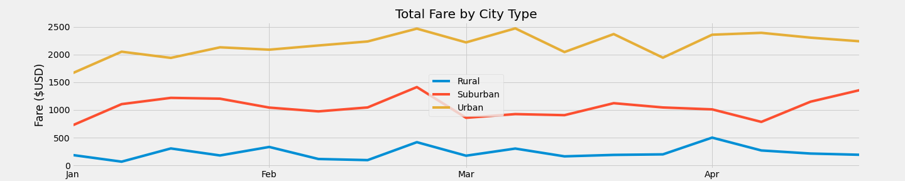
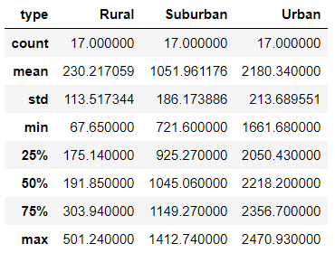

# PyBer Analysis

## Overview
The purpose of this analysis is to visualize how the data differs by city type and how those differences can be used by decision-makers at PyBer.
For that, a summary DataFrame and a line plot were created.

## Results
### Rides Summary

- As can be seen from the table, *Total Rides* corresponds to the demand of rides,*Total Drivers* to the supply and *Total Fares* to the sum of fares and they grow as with the population, being the *Urban* type the largest,the *Suburban* an finally *Rural* the smallest.
- When analysing the *Average Fare per Ride*, *Average Fare per Driver* and *Average Rides per Driver* columns, the city type appears to indicate a negative correlation to this variable. This is because the number of rides per city type grows slower than the number of drivers per city type.
- It is very interesting to see that for *Urban* cities, there are more drivers than rides. This explains the jump in *Average Fare per Driver* between the city types. Since the *Average Rides per Driver* column is a good indicator for the demand and supply relation, it is a good indicator for *Average Fare per Ride* and *Average Fare per Driver*. 
### Fares in time
|Fares in time                         | Statistics |
--------------------------------------:|:--------------------------------
   | 
- The *Suburban* and *Rural* fares seem to be very flat 