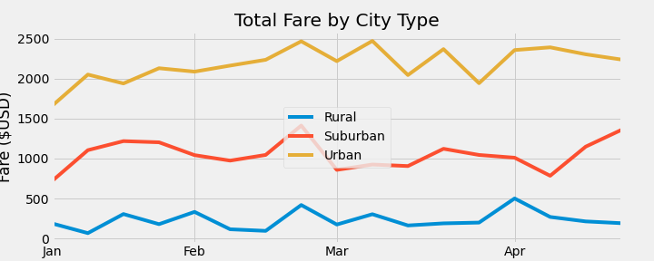

# PyBer Analysis

## Overview
The purpose of this analysis is to visualize how the data differs by city type and how those differences can be used by decision-makers at PyBer.
For that, a summary DataFrame and a line plot were created.

## Results
### Rides Summary

- As can be seen from the table, *Total Rides* corresponds to the demand of rides,*Total Drivers* to the supply and *Total Fares* to the sum of fares and they grow as with the population, being the *Urban* type the largest,the *Suburban* an finally *Rural* the smallest.
- When analysing the *Average Fare per Ride*, *Average Fare per Driver* and *Average Rides per Driver* columns, the city type appears to indicate a negative correlation to this variable. This is because the number of rides per city type grows slower than the number of drivers per city type, but the volume of rides is enough to compensate and make the *Total Fares* grow according to the city type.
- It is very interesting to see that for *Urban* cities, there are more drivers than rides. This explains the jump in *Average Fare per Driver* between the city types. Since the *Average Rides per Driver* column is a good indicator for the demand and supply relation, it is a good indicator for *Average Fare per Ride* and *Average Fare per Driver*.
- The *Urban* city type has an *Average Rides per Driver* lower than 1. That means that there is an excess of drivers, or a lack of rides.
### Fares in time
|Fares in time                         | Statistics |
:-------------------------------------:|:--------------------------------:
   | 
- We can see that each city type has it's own range of prices and they don't overlap.
- There seems to be a peak for all the city types on the fourth week of February.
- They are all very volatile with high standar deviation in comparison to the fare range (max - min), which makes it hard to predict future values base on the current ones.

## Summary
Based on the previous analysis, we recommend the following:
1. Given the fact that the different city types don't overlap, *Urban* seems to be the one generating the most amount of money and it has a very low *Average Rides per Driver*, the focus should be set on promoting more rides to these cities. This will should also rise the *Average Fare per Ride* and *Average Fare per Driver*
2. Besides the fourth week of February there doesn't seem to be a correlation between *Total Fares* and the dates. A special emphasis should be put on promotions around the holidays an the ends or beginnings of the months, when salaries are usually paid and people are more willing to pay.
3. In order to perform a deeper analysis, the population and income information of each city could help a lot to find the key variables to understand the *Total Fares* behaviour.